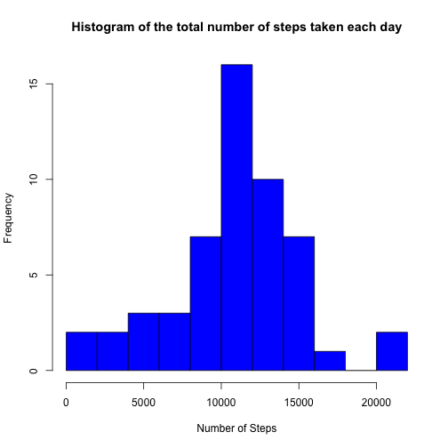
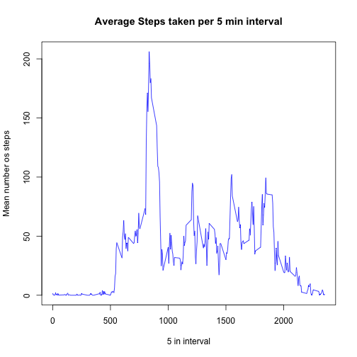
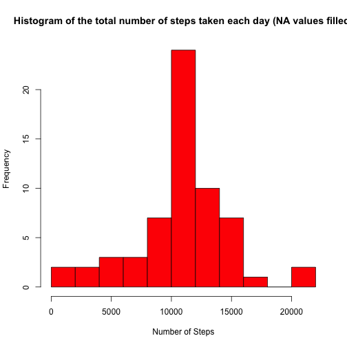
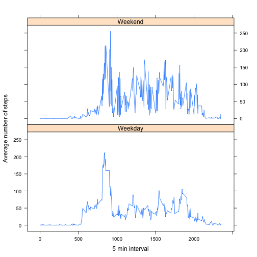

# Reproducible Research, Peer Assessment 1
==========================================
### By,Ismael González Flores
=============================


Loading [data](https://d396qusza40orc.cloudfront.net/repdata%2Fdata%2Factivity.zip) and libraies needed.


```r
data<- read.csv("activity.csv", header=TRUE, colClasses=c("numeric", "Date", "numeric"))
library(plyr)
library(lattice)
head(data)
```

```
##   steps       date interval
## 1    NA 2012-10-01        0
## 2    NA 2012-10-01        5
## 3    NA 2012-10-01       10
## 4    NA 2012-10-01       15
## 5    NA 2012-10-01       20
## 6    NA 2012-10-01       25
```
## What is mean total number of steps taken per day?
====================================================

For this part of the assignment, you can ignore the missing values in the dataset.


```r
tidy<- data.frame(subset(data, complete.cases(data)), row.names=NULL)
```


### 1. Make a histogram of the total number of steps taken each day
We separate de data in days and add all the steps taken each day


```r
tidy.sum<- data.frame(as.Date(unique(tidy$date)), 
                      tapply(tidy$steps, tidy$date, sum),
                      row.names=NULL)
names(tidy.sum)<- c("Date", "Sum.Steps")
head(tidy.sum)
```

```
##         Date Sum.Steps
## 1 2012-10-02       126
## 2 2012-10-03     11352
## 3 2012-10-04     12116
## 4 2012-10-05     13294
## 5 2012-10-06     15420
## 6 2012-10-07     11015
```
And now we plot the Hitogram of the total number of steps taken each day.

*Note: The x axis of the Histogram has ten levels of steps*

```r
hist1<-hist(tidy.sum$Sum.Steps, col="blue",
     main="Histogram of the total number of steps taken each day",
     xlab = "Number of Steps", breaks=10)
```

 


### 2. Calculate and report the mean and median total number of steps taken per day

Here is the code to calculate the mean and the median of the total number of steps 
taken per day.


```r
mean.steps<- round(mean(tidy.sum$Sum.Steps), digits=2)
median.steps<- median(tidy.sum$Sum.Steps)
```

The mean number of setps is **10766.19** and the median is **10765**.

## What is the average daily activity pattern?
==============================================

### 1. Make a time series plot (i.e. type = "l") of the 5-minute interval (x-axis) and the average number of steps taken, averaged across all days (y-axis)

First we create a data with the average steps taken per interval across all days.


```r
tidy.interval<- ddply(tidy, ~interval, summarise, Mean.Steps=mean(steps))
```

Now we make the plot


```r
plot(tidy.interval$interval, tidy.interval$Mean.Steps, 
     col="blue", type="l", main= "Average Steps taken per 5 min interval",
     xlab= "5 in interval", ylab="Mean number os steps")
```

 


### 2. Which 5-minute interval, on average across all the days in the dataset, contains the maximum number of steps?

First we obtain the max value of average steps and then we sear the corresponding interval.

```r
max.steps<-max(tidy.interval$Mean.Steps)
max.interval<- tidy.interval[tidy.interval$Mean.Steps==max.steps, 1]
```
The 5 min interval with the maximun average number of steps is the interval: **835**.

## Imputing missing values
==========================

Note that there are a number of days/intervals where there are missing values (coded as NA). The presence of missing days may introduce bias into some calculations or summaries of the data.

### 1. Calculate and report the total number of missing values in the dataset (i.e. the total number of rows with NAs)

Here is the code to obtain the total number of missing values(NA) in the data.


```r
missing<- nrow(data)-nrow(tidy)
```
The total number of missing values are: **2304**.

### 2.Devise a strategy for filling in all of the missing values in the dataset. The strategy does not need to be sophisticated. For example, you could use the mean/median for that day, or the mean for that 5-minute interval, etc.

My strategy consists in filling the missing values with the average steps taken in the corresponding interval across all days.


```r
fill.data <- data
fill.data$steps <- mapply(function(steps, interval) 
        if (is.na(steps)) 
                tidy.interval[tidy.interval$interval == interval, 2]
        else
                steps, fill.data$steps, fill.data$interval)
head(fill.data)
```

```
##     steps       date interval
## 1 1.71698 2012-10-01        0
## 2 0.33962 2012-10-01        5
## 3 0.13208 2012-10-01       10
## 4 0.15094 2012-10-01       15
## 5 0.07547 2012-10-01       20
## 6 2.09434 2012-10-01       25
```

### 3. Create a new dataset that is equal to the original dataset but with the missing data filled in.

The data was already created in the code above.

### 4. Make a histogram of the total number of steps taken each day and Calculate and report the mean and median total number of steps taken per day. Do these values differ from the estimates from the first part of the assignment? What is the impact of imputing missing data on the estimates of the total daily number of steps?

Histogram with the filled data

```r
fill.sum<- data.frame(as.Date(unique(fill.data$date)), 
                      tapply(fill.data$steps, fill.data$date, sum),
                      row.names=NULL)
names(fill.sum)<- c("Date", "Sum.Steps")
head(fill.sum)
```

```
##         Date Sum.Steps
## 1 2012-10-01     10766
## 2 2012-10-02       126
## 3 2012-10-03     11352
## 4 2012-10-04     12116
## 5 2012-10-05     13294
## 6 2012-10-06     15420
```

```r
hist2<- hist(fill.sum$Sum.Steps, col="red",
     main="Histogram of the total number of steps taken each day (NA values filled)",
     xlab = "Number of Steps", breaks=10)
```

 

Now we recalculated the mean and median values of steps with the filled data.


```r
fill.mean.steps<- round(mean(fill.sum$Sum.Steps), digits=4)
fill.median.steps<- round(median(fill.sum$Sum.Steps), digits=4)
```
The mean number of setps is **10766.1887** and the median is **10766.1887**.

## Are there differences in activity patterns between weekdays and weekends?
============================================================================

For this part the weekdays() function may be of some help here. Use the dataset with the filled-in missing values for this part.

```r
days<- weekdays(as.Date(fill.data$date))
fill.data$Wday<-days
```

### 1. Create a new factor variable in the dataset with two levels – “weekday” and “weekend” indicating whether a given date is a weekday or weekend day.


```r
fill.data$wd<- ifelse(fill.data$Wday==c("Sunday", "Saturday"), "Weekend", "Weekday")
```

### 2. Make a panel plot containing a time series plot (i.e. type = "l") of the 5-minute interval (x-axis) and the average number of steps taken, averaged across all weekday days or weekend days (y-axis). 

First we separate the data into interval, weekday or weekend and ad a column of the mean steps.

```r
Steps.wd<-ddply(fill.data, .(interval, wd), summarise, Mean.Steps=mean(steps))
```

And now we do the plot:


```r
xyplot(Mean.Steps~interval|wd,
       data= Steps.wd, layout=c(1,2),type="l", 
       xlab= "5 min interval", ylab="Average number of steps")
```

 


